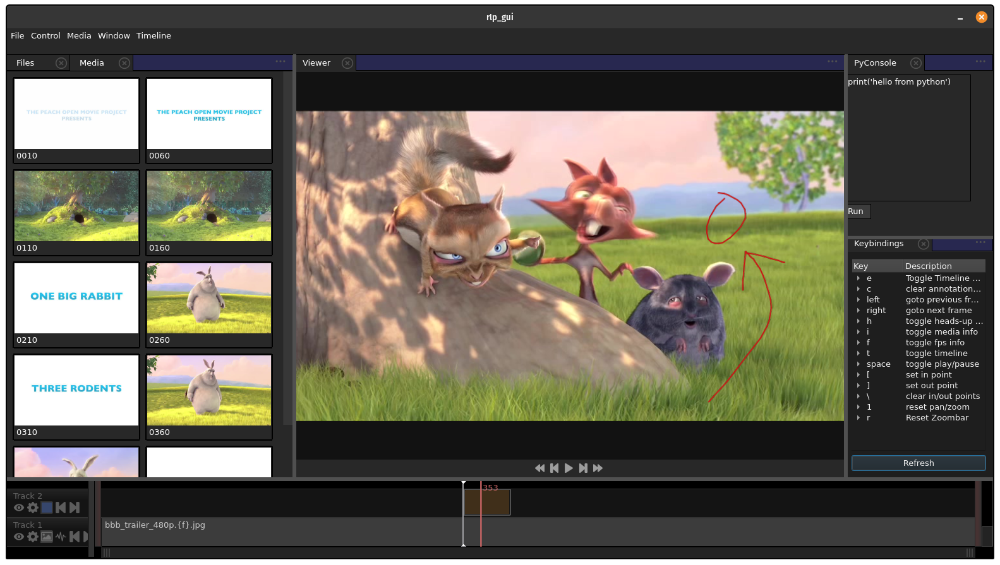

revlens is a multitrack media playback and review toolset with realtime annotations and multiuser sync.

# Features - 19.05.11

Check [dev blog](dev_blog.md) for the most up-to-date info on current functionality and development progress.

## Platform support

- Linux, Windows, OSX, iOS

## Playback

- frame accurate scrubbing
- mutlithreaded lookahead caching
- gapless playback (video and audio)
- playback modes (forward, backward, ping pong)

## Format support

- Format support via plugin architecture
- Frame sequence (tif, jpg, exr, etc) and container media (mov, avi, mp4, etc)
- Audio (separate audio files or emebedded audio in media container)
- Implemented plugins: FFMpeg, OpenEXR, common image formats (tiff, jpg, etc)

## Display

- Zoom, Pan
- Linear and nonlinear encoding (OCIO support coming soon)
- real time heads up display

## Timeline

- Multitrack media
- movable split slider
- global in / out points
- horizontal zoombar
- per-clip waveform and thumbnail display
- per-clip in and out points
- frame ticks (auto scaling)
- custom tracks

## Annotations

- per-frame annotations
- multitrack annotations
- real time held frames
- brush system
- palm rejection (iOS)

## Sync

- real time, room-based sync for arbitrary number of participants
- multitrack sync
- annotation sync

## Scripting

- embedded Python interpreter and Python API
- Javascript API for web-based tools

## Interface

- programmable, remappable hotkeys
- tiling, nonoverlapping UI panes
- custom layouts
- custom widgets (Qt / Python or Javascript / web based)
- load and save sessions

# Download

revlens is not currently available for public use (yet). Feel free to contact me if you are interested in the product!
